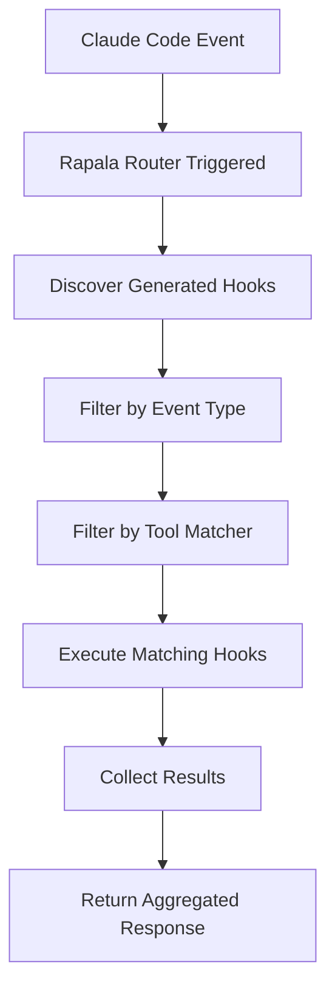

# 🎣 Rapala Router Architecture

## Overview

The Rapala Router is a revolutionary architecture for Claude Code hook management that eliminates the need to manually configure hooks in `settings.json`. Instead of adding each hook individually, you only install the Rapala Router once, and it dynamically discovers and executes all generated hooks automatically.

## Core Concept

**Traditional Approach:**
```json
// settings.json - Must manually add every hook
{
  "hooks": {
    "PreToolUse": [
      {"command": "node hook1.js"},
      {"command": "node hook2.js"},
      {"command": "node hook3.js"}
    ]
  }
}
```

**Rapala Router Approach:**
```json
// settings.json - Only install the router once
{
  "hooks": {
    "PreToolUse": [
      {"command": "node rapala-router/index.js"}
    ]
  }
}
```

The router automatically discovers and executes all generated hooks without any configuration changes.

## Architecture Components

### 1. Rapala Router Core (`rapala-router/index.js`)

The central dispatcher that:
- Scans the hooks directory for generated hooks
- Filters hooks based on event type and tool matcher
- Executes matching hooks dynamically
- Provides comprehensive logging and error handling

### 2. Generated Hook Structure

Each generated hook follows this structure:
```
hooks/
├── generated-hook-name-123456/
│   ├── config.json          # Hook metadata and configuration
│   └── index.js             # Hook implementation
```

**config.json format:**
```json
{
  "name": "hook-name",
  "description": "Hook description",
  "events": ["PreToolUse", "PostToolUse"],
  "matcher": "Bash|Edit|Write",
  "installationType": "generated"
}
```

### 3. Hook Discovery Algorithm

```javascript
// Router discovers hooks by:
1. Scanning hooks/ directory for subdirectories
2. Looking for config.json + index.js pairs
3. Filtering for installationType: "generated"
4. Loading hook metadata and capabilities
5. Building execution registry
```

## Event System

### Supported Events

| Event | When It Fires | Use Cases |
|-------|---------------|-----------|
| **PreToolUse** | Before any tool executes | Command interception, validation, preprocessing |
| **PostToolUse** | After tool completes successfully | Formatting, testing, notifications, cleanup |
| **Stop** | When Claude Code finishes responding | Final actions, summaries, reports |
| **UserPromptSubmit** | When user submits input | Input validation, logging, preprocessing |

### Tool Matchers

| Matcher | Matches | Example Use Cases |
|---------|---------|-------------------|
| `Bash` | Bash commands | Command logging, tmux sessions, security scanning |
| `Edit\|MultiEdit\|Write` | File operations | Code formatting, linting, backup creation |
| `Read` | File reading | Access logging, cache warming |
| `""` (empty) | All tools | Universal logging, performance monitoring |

## Dynamic Command Generation

### Using `/rapala` Slash Command

The `/rapala` command generates hooks from natural language:

```bash
/rapala create a hook that runs all bash commands in isolated tmux sessions
/rapala format Python files after editing them
/rapala run tests whenever files are modified
/rapala log all file operations to audit.log
```

### Hook Generation Process

1. **Natural Language Parsing**: Analyzes description for event type and tool matcher
2. **Code Generation**: Creates JavaScript hook implementation
3. **Configuration Creation**: Generates config.json with proper metadata
4. **Auto-Discovery**: Router immediately finds and loads the new hook

## Implementation Details

### Router Execution Flow



### Hook Matching Logic

```javascript
function hookMatches(hook, eventType, toolName) {
  // Check event type
  if (!hook.events.includes(eventType)) return false;
  
  // Check tool matcher
  if (hook.matcher) {
    const matchers = hook.matcher.split('|');
    return matchers.includes(toolName);
  }
  
  // No matcher = matches all tools
  return true;
}
```

### Execution Model

- **Sequential Execution**: Hooks execute one after another
- **Error Isolation**: Failed hooks don't block others
- **Result Aggregation**: All results collected and returned
- **Timeout Handling**: Individual hook timeouts prevent hanging

## Use Cases & Examples

### 1. Development Workflow Automation

```javascript
// Generated automatically from: "/rapala run prettier on all JavaScript files after editing"
{
  "events": ["PostToolUse"],
  "matcher": "Edit|MultiEdit|Write",
  "implementation": "format JavaScript files with prettier"
}
```

### 2. Security & Compliance

```javascript
// Generated from: "/rapala scan for secrets before committing"
{
  "events": ["PreToolUse"],
  "matcher": "Bash",
  "implementation": "scan files for API keys, passwords, tokens"
}
```

### 3. Testing Integration

```javascript
// Generated from: "/rapala run tests after any file change"
{
  "events": ["PostToolUse"],
  "matcher": "",
  "implementation": "execute test suite automatically"
}
```

### 4. Command Isolation

```javascript
// Generated from: "/rapala run every bash command in tmux"
{
  "events": ["PreToolUse"],
  "matcher": "Bash",
  "implementation": "create unique tmux session per command"
}
```

## Advanced Features

### Multi-Hook Execution

Multiple hooks can execute on the same event:
```javascript
// For PostToolUse + Edit event:
1. Python formatter hook
2. Test runner hook  
3. Git auto-commit hook
4. Performance monitor hook
```

### Dynamic Hook Management

- **Live Discovery**: New hooks available immediately without restarts
- **Selective Execution**: Hooks only run when conditions match
- **Performance Optimization**: Only active hooks are loaded
- **Memory Efficiency**: Hooks execute in child processes

### Debugging & Monitoring

The router provides comprehensive logging:
```
🎣 Rapala Router: Event=PostToolUse, Tool=Edit
🎣 Rapala Router: Found 3 generated hooks
🎣 Rapala Router: Hook python-formatter - Events: [PostToolUse], Matcher: "Edit" - Matches: true
🎣 Rapala Router: Executing python-formatter for PostToolUse/Edit
🎣 Rapala Router: Completed with 1 executed hooks
```

## Installation & Setup

### One-Time Router Installation

Add to `~/.claude/settings.json`:
```json
{
  "hooks": {
    "PreToolUse": [
      {
        "matcher": "",
        "hooks": [
          {
            "type": "command",
            "command": "node \"/path/to/rapala-router/index.js\""
          }
        ]
      }
    ],
    "PostToolUse": [
      {
        "matcher": "",
        "hooks": [
          {
            "type": "command", 
            "command": "node \"/path/to/rapala-router/index.js\""
          }
        ]
      }
    ]
  }
}
```

### Hook Generation

Use the `/rapala` slash command or direct generation:
```bash
node src/hook-generator.js "description of desired behavior"
```

## Benefits

### ✅ **Simplified Management**
- No manual settings.json editing
- Automatic hook discovery
- Zero-configuration new hooks

### ✅ **Dynamic Scalability** 
- Add unlimited hooks without configuration changes
- Runtime hook loading
- Memory-efficient execution

### ✅ **Developer Experience**
- Natural language hook creation
- Immediate availability of new hooks
- Comprehensive debugging output

### ✅ **Enterprise Ready**
- Centralized hook management
- Audit trail of all hook executions
- Error isolation and recovery

## Comparison with Traditional Hooks

| Aspect | Traditional Hooks | Rapala Router |
|--------|------------------|---------------|
| **Configuration** | Manual settings.json editing | One-time router setup |
| **Scalability** | Limited by configuration size | Unlimited dynamic hooks |
| **Deployment** | Restart required | Immediate availability |
| **Management** | Per-hook configuration | Centralized discovery |
| **Debugging** | Individual hook logs | Aggregated router logs |
| **Maintenance** | High overhead | Minimal overhead |

## Future Enhancements

- **Remote Hook Registry**: Download hooks from repositories
- **Hook Dependencies**: Declare hook execution order
- **Conditional Execution**: Advanced matching logic
- **Performance Analytics**: Hook execution metrics
- **Hot Reloading**: Dynamic hook updates without restart

## Conclusion

The Rapala Router Architecture revolutionizes Claude Code hook management by providing a dynamic, scalable, and maintainable approach to extending Claude Code functionality. By eliminating manual configuration and enabling natural language hook generation, it makes advanced workflow automation accessible to all users.

The architecture's power lies in its simplicity: **install once, generate infinitely**. 🎣