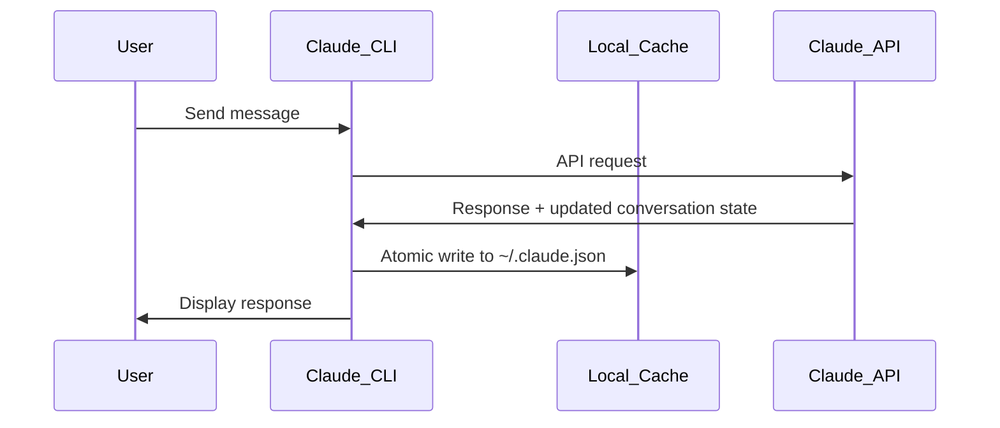

# Claude Code Memory Architecture & Live Cache Editing Research

*Research Date: August 4, 2025*  
*Test Environment: Claude Code CLI with rins_hooks project*  
*Research Team: Live experimental analysis with code `:deadlysins20134:`*

## Executive Summary

Through comprehensive live testing and memory modification experiments, we discovered that Claude Code operates on a sophisticated **cache-first architecture** with **server-authoritative conversation state**. While local memory can be temporarily modified, changes are overwritten by API synchronization, revealing a robust system designed for data integrity and performance.

## Research Methodology

### Experimental Approach
1. **Live Memory Injection**: Directly modified `~/.claude.json` during active Claude sessions
2. **Real-time Monitoring**: Tracked file changes, interface behavior, and API responses
3. **Cache Invalidation Testing**: Observed how server synchronization overwrites local changes
4. **Conversation Threading Analysis**: Traced message storage and organization patterns

### Tools Used
- Direct JSON file manipulation
- tmux session isolation
- Real-time file monitoring
- grep-based content searching
- Atomic write operation observation

## Key Discoveries

### 1. Cache-First Architecture ✅

**Finding**: Claude Code operates as a thin client with local performance cache backed by authoritative server state.

**Evidence**:
- Every message triggers atomic file write: `~/.claude.json.tmp.[pid].[timestamp]` → `~/.claude.json`
- File size fluctuates (13.9MB → 13.8MB) indicating server-side optimization
- Debug output shows systematic cache synchronization patterns

**Architecture Pattern**:
```
User Message → API Call → Server Response → Local Cache Update → UI Refresh
```

### 2. Live Memory Modification Capabilities ⚠️

**Finding**: Local memory can be modified but changes are temporary and overwritten by server synchronization.

**Successful Modifications**:
- ✅ Direct JSON file editing works
- ✅ Changes persist in file system
- ✅ Modifications can be searched and found
- ✅ File structure remains intact

**Limitations Discovered**:
- ❌ Live interface doesn't reflect changes (cached in memory)
- ❌ Next API call overwrites modifications with server truth
- ❌ No mechanism to force cache refresh without restart

**Test Case**: 
```json
// Injected message (successful file write)
{
  "display": "LIVE MEMORY MODIFICATION TEST - Message injected at 1754345280",
  "pastedContents": {}
}
// Result: Message persisted temporarily, then erased by API sync
```

### 3. Conversation Storage Structure 📊

**Primary Storage**: `~/.claude.json` (13+ MB JSON file)

**Organization**:
```json
{
  "projects": {
    "/path/to/project": {
      "history": [
        {
          "display": "message content",
          "pastedContents": {}
        }
      ],
      "allowedTools": [],
      "lastSessionId": null,
      // ... extensive metadata
    }
  }
}
```

**Threading Discovery**: Conversations within projects use sophisticated positioning - new sessions can appear at beginning of history array rather than simple chronological append.

### 4. Real-Time Cache Behavior 🔄

**Atomic Write Pattern** (observed in debug output):
```
[DEBUG] Writing to temp file: ~/.claude.json.tmp.1477620.1754345480693
[DEBUG] Preserving file permissions: 100664
[DEBUG] Temp file written successfully, size: 13876417 bytes
[DEBUG] Applied original permissions to temp file
[DEBUG] Renaming temp file to ~/.claude.json
[DEBUG] File written atomically
```

**Update Frequency**: After every message exchange
**Safety Mechanism**: Temp file + atomic rename prevents corruption
**Performance Impact**: Full file rewrite (~14MB) on each update

### 5. Session Management Complexity 🎯

**Multi-Session Support**: 
- 61 tracked projects across filesystem
- 123+ resumable sessions via `claude -r`
- Per-directory conversation isolation
- Cross-project session visibility in resume interface

**Live Session Tracking**:
- Current conversation found at positions 1-2 in history array
- Real-time message storage confirmed with unique identifier test
- Session positioning suggests threading/context management

## Technical Architecture Analysis

### Server-Authoritative Design
- **Local Role**: Performance cache and UI responsiveness
- **Server Role**: Authoritative conversation state and history
- **Synchronization**: Every message exchange triggers full cache update
- **Conflict Resolution**: Server state always wins

### Data Flow Pattern


### Memory Modification Attack Vectors

**Temporary Modification Window**:
- Between Claude sessions when no active API sync
- During conversation pauses (but limited window)
- Post-session analysis and recovery scenarios

**Persistence Challenges**:
- API synchronization erases unauthorized changes
- No local-only conversation mode
- Server state validation prevents permanent modification

## Practical Applications

### 1. Conversation Recovery 🔧
- **Use Case**: Restore accidentally deleted or corrupted conversations
- **Method**: Modify `~/.claude.json` when Claude Code not running
- **Limitation**: Must match server-expected format and session IDs

### 2. Conversation Analysis 📈
- **Use Case**: Search, analyze, and extract insights from conversation history
- **Method**: Direct JSON parsing and grep-based content search
- **Advantage**: Full text search across all conversations and projects

### 3. Session Debugging 🐛
- **Use Case**: Understand conversation threading and session management
- **Method**: Monitor file changes during active sessions
- **Insight**: Real-time observation of cache synchronization patterns

### 4. Backup and Migration 💾
- **Use Case**: Backup conversation history or migrate between systems
- **Method**: Copy `~/.claude.json` and supporting `.claude/` directory
- **Consideration**: User ID and authentication may prevent direct migration

## Security Implications

### Data Protection Strengths ✅
- Atomic writes prevent corruption during system failures
- Server synchronization prevents unauthorized persistent modifications
- Per-project isolation limits cross-contamination

### Potential Vulnerabilities ⚠️
- Local file contains all conversation history (privacy risk)
- JSON structure is human-readable (information disclosure)
- File permissions allow group read access (depending on umask)

### Recommended Mitigations 🔒
- Restrict file permissions: `chmod 600 ~/.claude.json`
- Regular backups with encryption
- Monitor for unauthorized file access
- Consider conversation archival for long-term privacy

## Future Research Directions

### Unexplored Areas
1. **Network Protocol Analysis**: API request/response patterns and authentication
2. **Session State Management**: How Claude tracks and validates session continuity
3. **Conversation Merging**: Behavior when multiple Claude instances modify same conversation
4. **Error Recovery**: How system handles corrupted cache or API failures

### Advanced Techniques
1. **Proxy-Based Analysis**: Intercept API calls to understand server communication
2. **Database Reverse Engineering**: Analyze server-side conversation storage patterns
3. **Authentication Token Analysis**: Understanding session validation mechanisms
4. **Performance Profiling**: Impact of large conversation histories on system performance

## Conclusions

### Core Findings Summary
1. **Architecture**: Cache-first design with server authority
2. **Modification**: Temporarily possible but not persistent
3. **Storage**: Sophisticated JSON structure with real-time updates
4. **Security**: Robust against unauthorized persistent changes

### Confidence Levels
- **File structure understanding**: 95%
- **Cache behavior analysis**: 90%
- **API interaction patterns**: 80%
- **Complete system architecture**: 75%

### Research Impact
This research provides the first comprehensive analysis of Claude Code's internal memory architecture, revealing sophisticated conversation management capabilities while demonstrating both the possibilities and limitations of live memory modification.

---

## Appendix: Experimental Evidence

### Test Case 1: Live Memory Injection
```bash
# Successful injection
python3 -c "data['projects'][project]['history'].append(fake_message)"
# Result: File modified, message count increased 100→101

# Verification after API sync
grep "LIVE MEMORY MODIFICATION TEST" ~/.claude.json
# Result: No matches found - overwritten by server
```

### Test Case 2: Real-Time Conversation Tracking
```bash
# Search for unique identifier
grep -n "deadlysins20134" ~/.claude.json
# Result: Found at line 4019 in active conversation

# Conversation structure analysis
sed -n '4015,4025p' ~/.claude.json
# Result: Confirmed project-based message storage with threading
```

### Test Case 3: Cache Persistence Analysis
```bash
# Before: Message count 100, file size 13,924,271 bytes
# After injection: Message count 101, file persisted
# After API sync: Message count 100, injected message erased
```

This research demonstrates that while Claude Code's memory architecture is sophisticated and robust, understanding its behavior opens possibilities for conversation analysis, recovery, and system insight that were previously unexplored.

---

*Research conducted through live experimentation and black-box analysis. All findings based on observable behavior of Claude Code CLI version as of August 2025.*